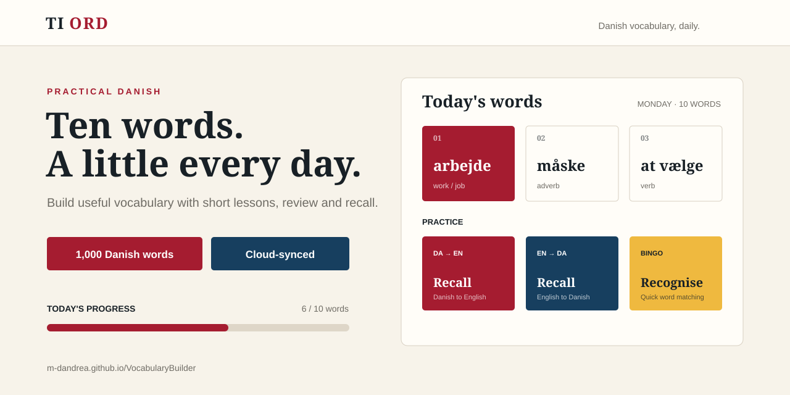

# Ti Ord

**A simple Danish vocabulary trainer for building practical vocabulary a few words at a time.**

<p align="center">
  
</p>

<p align="center">
  <strong><a href="https://m-dandrea.github.io/VocabularyBuilder/">Try Ti Ord →</a></strong>
</p>

Ti Ord is a lightweight web application designed for learners who want a structured way to expand their Danish vocabulary without turning practice into a large daily task. It combines short daily lessons, vocabulary placement, review exercises, and a personal glossary in a responsive interface that works on both desktop and mobile.

## What it offers

- **1,000 Danish words** organised by difficulty and practical topic
- **Personalised starting point** through an optional vocabulary placement check
- **5, 10 or 20 words per lesson**
- **Daily vocabulary practice** with additional word sets available on demand
- **Danish → English and English → Danish recall exercises**
- **Word bingo** for active recognition practice
- **Automatic review** of previously introduced vocabulary
- **Personal glossary** with translations, explanations and related words
- **Topic filtering** so learners can skip vocabulary they do not need
- **Cloud-synchronised progress** across devices
- **Responsive design** for phone and desktop

## Accounts and privacy

Ti Ord does not require an email address or personal profile information. An account consists of a username and password so that learning progress can be synchronised between devices.

Passwords are salted and hashed on the backend before storage. Vocabulary progress and preferences are stored in Supabase, while the browser keeps a local copy for the active session.

## Technology

The application intentionally uses a small stack:

- Vanilla HTML, CSS and JavaScript
- GitHub Pages for the frontend
- Supabase for cloud storage and profile synchronisation
- Supabase Edge Functions for account and profile operations

There is no framework build step and the vocabulary data is bundled with the application.

## Run locally

Clone the repository and serve the directory with any static web server. For example:

```bash
python -m http.server 8000
```

Then open `http://localhost:8000` in a browser.

Cloud account functionality requires the configured Supabase backend. The vocabulary interface itself is a static web application.

## Vocabulary data

The vocabulary combines curated Danish entries with Danish–English data from [FreeDict](https://freedict.org/) and frequency information from the Danish 2018 list in [FrequencyWords](https://github.com/hermitdave/FrequencyWords).

Source and frequency metadata are retained with the dictionary entries. Third-party licensing information is available in [`THIRD_PARTY_LICENSES.txt`](THIRD_PARTY_LICENSES.txt).

---

**Ti Ord** — practical Danish vocabulary, built for consistent daily practice.
